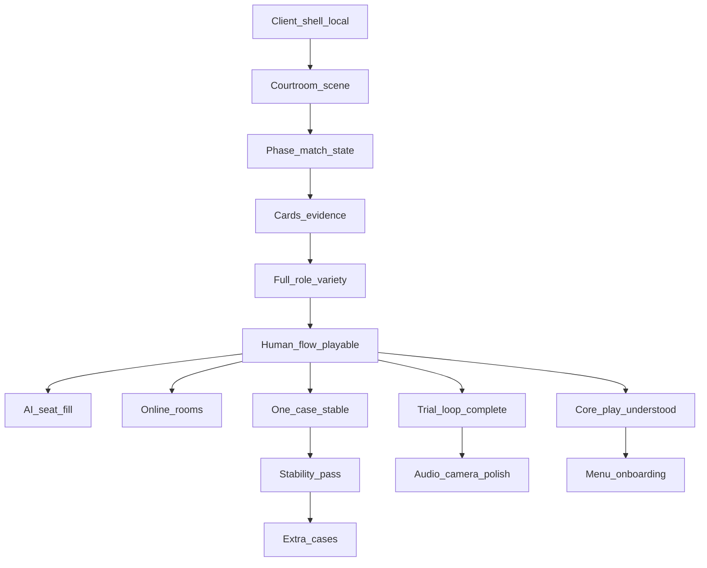

# Production sequencing (canonical build order)

**Purpose:** Lock **implementation order** so agents and humans do not jump ahead and break dependencies. This document **is** the repo’s interpretation of Vision Phase 4 in [`01_game_vision_execution_checklist.md`](01_game_vision_execution_checklist.md).

**Related:** bounds in [`mvp-scope.md`](mvp-scope.md), assets in [`art_direction_and_assets.md`](art_direction_and_assets.md), systems breakdown in [`04_technical_architecture_execution_checklist.md`](04_technical_architecture_execution_checklist.md).

---

## Ordered rules (do not skip ahead)

| Step | Rule | Why |
|------|------|-----|
| **1** | **Client shell before networking** | Rendering, UI roots, and local loop must work before Colyseus/auth/rooms; avoids debugging net + graphics together. |
| **2** | **Courtroom scene before content variety** | One believable space + cameras validates pipeline; extra cases/maps before that multiplies waste. |
| **3** | **Phase-based match state before UI polish** | If trial phases/turns are wrong, pretty UI hides bugs. Nail state machine and debug visibility first. |
| **4** | **Cards and evidence system before full role variety** | Counsel actions + evidence are the spine; peripheral roles plug in once the spine accepts structured actions. |
| **5** | **AI seat-filling after human flow works locally** | Bots mask broken human paths; ship keyboard/debug-driven human slice first. |
| **6** | **Online rooms only after offline flow is playable** | Same as (1): authoritative server joins a working local trial, not a stub. |
| **7** | **Content expansion only after one full case is stable** | Prove one case end-to-end before authoring 3–5; data schema churn otherwise. |
| **8** | **Audio and camera polish after the trial loop is complete** | SFX/cinematics are last-mile juice; core loop must be fun/solvable in silence first. |
| **9** | **Menu and onboarding after core play is understandable** | Skip lobby wizardry until testers can complete a trial from a dev entry. |
| **10** | **Stability pass before building extra cases** | Freeze churn, fix crashes/regressions, **then** duplicate case work. |

**Violation policy:** Deviating from this order requires a **dated decision + rationale** in [`TODO_IMPLEMENTATION.md`](../TODO_IMPLEMENTATION.md) session log ([`AGENTS.md`](../AGENTS.md)).

---

## How this maps to milestones

Use [`01_game_vision_execution_checklist.md`](01_game_vision_execution_checklist.md) **Phase 5** milestones as **verification gates**. Rough alignment:

- Steps **1–3** support reaching **Milestone C** (local trial flow + phases).
- Step **4** aligns with **Milestone D**.
- Judge/Jury steps in milestones **E–F** follow **3** and **4**.
- Steps **5–6** align with **G–H**.
- Step **7** and **10** guard **Milestone I** (multiple cases).
- Steps **8–9** precede declaring **Milestone J** shippable.

---

## Dependency overview

---

## Document status

When Vision Phase 4 checklist items are marked complete in [`01_game_vision_execution_checklist.md`](01_game_vision_execution_checklist.md), this ordering is **locked** until a session-logged change.
